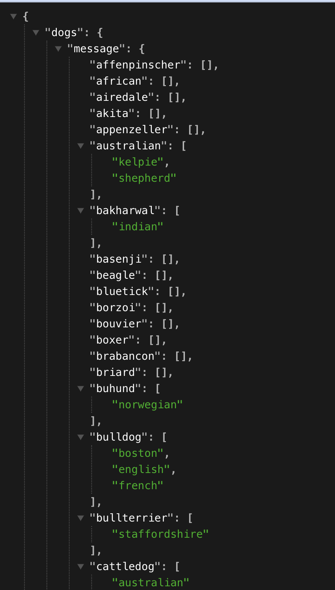
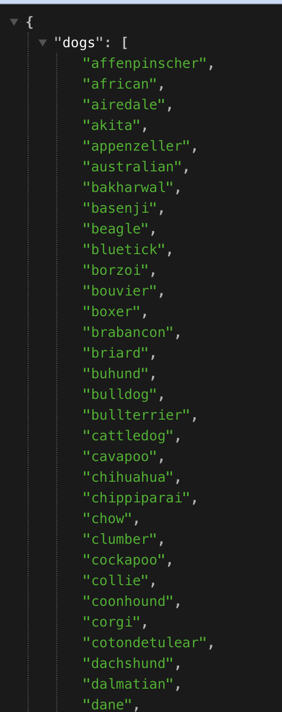

# My First FastAPI Project

This is a simple project created to learn and implement my first API in Python using FastAPI.

## Overview

The goal of this project is to explore FastAPI, a modern, fast (high-performance), web framework for building APIs with Python 3.7+.

## Goals

- Basic FastAPI application with a couple of endpoints.
- Demonstrates how to define an API route and format the response.

## Installation

1. Clone the repository:

   ```bash
   git clone https://github.com/Alaina-Noel/fastapi_project.git

### Installation dependencies
   pip install -r requirements.txt

## To spin up the server
Open a terminal window and run `uvicorn main:app --reload`
 & go to the url provided in your terminal

## If you don't feel like installing anything this is what the response looks like unformatted versus formatted





